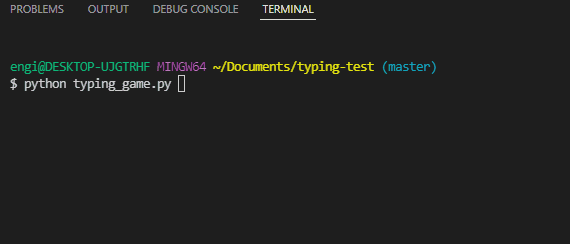

# Typing Game
Typing speed test

Tested on Python3.6 in Windows

To play
1. clone this repository and change to the repository directory in your terminal
1. `pip install click  # you are encouraged to use a virtual environment`
1. `python typing_game.py  # the clock starts on your first keystroke. Start typing!`

# Dev
Make your changes and test `python test_typing.py`. Note, the test does not pass ATM. I have not put much thought into why the actual LPS is so much lower than the expected LPS.
